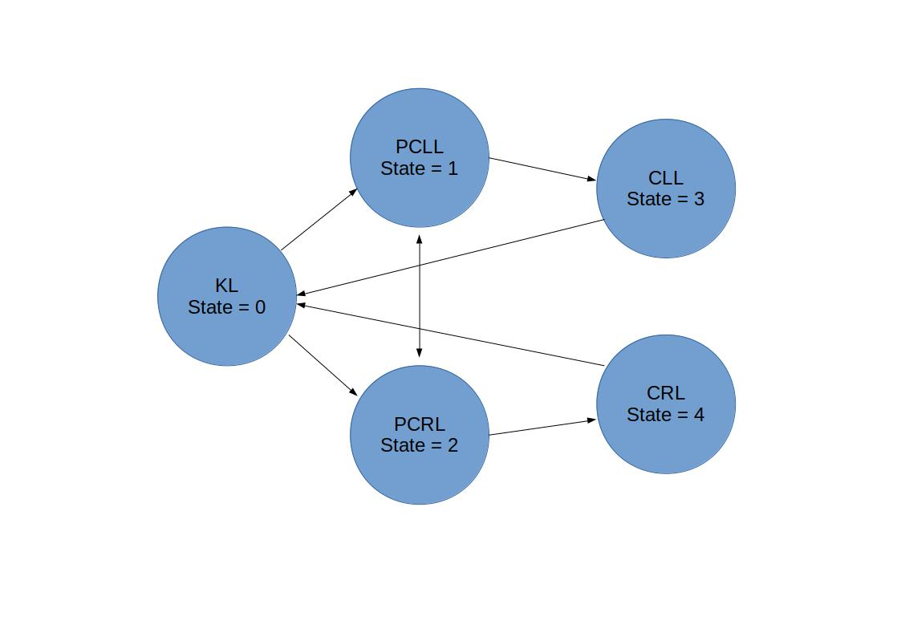
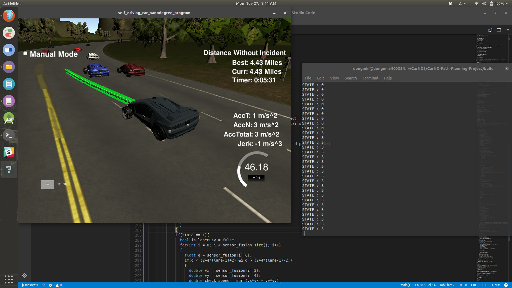

# CarND-Path-Planning-Project
Self-Driving Car Engineer Nanodegree Program
   
### Simulator.
You can download the Term3 Simulator which contains the Path Planning Project from the [releases tab (https://github.com/udacity/self-driving-car-sim/releases).

### Goals
In this project your goal is to safely navigate around a virtual highway with other traffic that is driving +-10 MPH of the 50 MPH speed limit. You will be provided the car's localization and sensor fusion data, there is also a sparse map list of waypoints around the highway. The car should try to go as close as possible to the 50 MPH speed limit, which means passing slower traffic when possible, note that other cars will try to change lanes too. The car should avoid hitting other cars at all cost as well as driving inside of the marked road lanes at all times, unless going from one lane to another. The car should be able to make one complete loop around the 6946m highway. Since the car is trying to go 50 MPH, it should take a little over 5 minutes to complete 1 loop. Also the car should not experience total acceleration over 10 m/s^2 and jerk that is greater than 10 m/s^3.

#### The map of the highway is in data/highway_map.txt
Each waypoint in the list contains  [x,y,s,dx,dy] values. x and y are the waypoint's map coordinate position, the s value is the distance along the road to get to that waypoint in meters, the dx and dy values define the unit normal vector pointing outward of the highway loop.

The highway's waypoints loop around so the frenet s value, distance along the road, goes from 0 to 6945.554.

## Basic Build Instructions

1. Clone this repo.
2. Make a build directory: `mkdir build && cd build`
3. Compile: `cmake .. && make`
4. Run it: `./path_planning`.

Here is the data provided from the Simulator to the C++ Program

#### Main car's localization Data (No Noise)

["x"] The car's x position in map coordinates

["y"] The car's y position in map coordinates

["s"] The car's s position in frenet coordinates

["d"] The car's d position in frenet coordinates

["yaw"] The car's yaw angle in the map

["speed"] The car's speed in MPH

#### Previous path data given to the Planner

//Note: Return the previous list but with processed points removed, can be a nice tool to show how far along
the path has processed since last time. 

["previous_path_x"] The previous list of x points previously given to the simulator

["previous_path_y"] The previous list of y points previously given to the simulator

#### Previous path's end s and d values 

["end_path_s"] The previous list's last point's frenet s value

["end_path_d"] The previous list's last point's frenet d value

#### Sensor Fusion Data, a list of all other car's attributes on the same side of the road. (No Noise)

["sensor_fusion"] A 2d vector of cars and then that car's [car's unique ID, car's x position in map coordinates, car's y position in map coordinates, car's x velocity in m/s, car's y velocity in m/s, car's s position in frenet coordinates, car's d position in frenet coordinates. 

## Details

1. The car uses a perfect controller and will visit every (x,y) point it recieves in the list every .02 seconds. The units for the (x,y) points are in meters and the spacing of the points determines the speed of the car. The vector going from a point to the next point in the list dictates the angle of the car. Acceleration both in the tangential and normal directions is measured along with the jerk, the rate of change of total Acceleration. The (x,y) point paths that the planner recieves should not have a total acceleration that goes over 10 m/s^2, also the jerk should not go over 50 m/s^3. (NOTE: As this is BETA, these requirements might change. Also currently jerk is over a .02 second interval, it would probably be better to average total acceleration over 1 second and measure jerk from that.

2. There will be some latency between the simulator running and the path planner returning a path, with optimized code usually its not very long maybe just 1-3 time steps. During this delay the simulator will continue using points that it was last given, because of this its a good idea to store the last points you have used so you can have a smooth transition. previous_path_x, and previous_path_y can be helpful for this transition since they show the last points given to the simulator controller with the processed points already removed. You would either return a path that extends this previous path or make sure to create a new path that has a smooth transition with this last path.

---

## Dependencies

* cmake >= 3.5
 * All OSes: [click here for installation instructions](https://cmake.org/install/)
* make >= 4.1
  * Linux: make is installed by default on most Linux distros
  * Mac: [install Xcode command line tools to get make](https://developer.apple.com/xcode/features/)
  * Windows: [Click here for installation instructions](http://gnuwin32.sourceforge.net/packages/make.htm)
* gcc/g++ >= 5.4
  * Linux: gcc / g++ is installed by default on most Linux distros
  * Mac: same deal as make - [install Xcode command line tools](https://developer.apple.com/xcode/features/)
  * Windows: recommend using [MinGW](http://www.mingw.org/)
* [uWebSockets](https://github.com/uWebSockets/uWebSockets)
* [spline](http://kluge.in-chemnitz.de/opensource/spline/)

## Editor Settings

We've purposefully kept editor configuration files out of this repo in order to
keep it as simple and environment agnostic as possible. However, we recommend
using the following settings:

* indent using spaces
* set tab width to 2 spaces (keeps the matrices in source code aligned)

## Code Style

Please (do your best to) stick to [Google's C++ style guide](https://google.github.io/styleguide/cppguide.html).

## Project Instructions and Rubric

Note: regardless of the changes you make, your project must be buildable using
cmake and make!

---

## Project Reflection

###About Model

In this project, I used FSM(finite state machine). This is consisted of 5 states.

*  KL(Keep Lane) - state = 0
*  PCLL(Prepare Change Left Lane) - state = 1
*  PCRL(Prepare Change Left Lane) - state = 2
*  CLL(Change Left Lane) - state = 3
*  CRL(Change Right Lane) - state = 4

Below Chart shows these all five states are transition functions.

#### Keep Lane

This state makes car keep lane and keep safety distance from front car. If there is no car in front of it, car keep the speed at about 49.5 mph. If any car is infront of it, car control it's velocity below target speed using Sensor Fusion and prepare change it's lane.(main.cpp line.225~287)

			for(int i = 0; i < sensor_fusion.size(); i++)
			{
				float d = sensor_fusion[i][6];
				if(d < (2+4*lane+2) && d > (2+4*lane-2))
				{
					double vx = sensor_fusion[i][3];
					double vy = sensor_fusion[i][4];
					double check_speed = sqrt(vx*vx + vy*vy);
					double check_car_s = sensor_fusion[i][5];
					double now_car_s = check_car_s;
					check_car_s += ((double)prev_size*.02*check_speed);		
					if((check_car_s > end_path_s && (check_car_s - end_path_s) < 20) || 
								abs(now_car_s - my_car_s) < 10 && (now_car_s > my_car_s))
					{
						if(state == 0)
						{
							if(lane > 0)
							{
								state = 1;
							}else
							{
								state = 2;
							}
						}
						can_boost = false;
						goal_vel = (check_speed -5) * 2.24;
					}
		 			if(can_boost == true){
						if(abs(now_car_s - car_s) > 30 && (now_car_s > car_s)){
							goal_vel = 49.5;
						}
					}		
				}
			}

#### Prepare Change Left Lane & Right Lane

These two states make car wait appropriate time to change lane, and keep watching cars which are in target lane for change lane. Also, same as state = 0, keep distance between front car. Each state detect their target lane was busy, then change target lane if proper target lane is existed.(ex) state = 1 -> 2)(main.cpp line.289~317 about PCLL)

				bool is_laneBusy = false;
				for(int i = 0; i < sensor_fusion.size(); i++)
				{
					float d = sensor_fusion[i][6];
					if(d < (2+4*(lane-1)+2) && d > (2+4*(lane-1)-2))
					{
						double vx = sensor_fusion[i][3];
						double vy = sensor_fusion[i][4];
						double check_speed = sqrt(vx*vx + vy*vy);
						double check_car_s = sensor_fusion[i][5];
						double now_car_s = check_car_s;
						check_car_s += ((double)prev_size*.02*check_speed);

						if((check_car_s - end_path_s < 30 && check_car_s - end_path_s > -10) || 
									((now_car_s - my_car_s < 10) && (now_car_s - my_car_s > -5)))
						{
							is_laneBusy = true;
						}
					}
				}
				if(is_laneBusy == false)
				{
					lane = lane - 1;
					state = 3;
				}else if(lane < 2){
					state = 2;
				}

#### Change Left Lane & Right Lane

When PCLL, PCRL get appropriate time to change lane, state change CLL, CRL. In these states, the target lane is reflected in the trajectory. And then finish it, state come back to 0.(main.cpp line.348~354 about CLL)

			{
				goal_vel = 49.5;
				if(car_d < (2+4*lane+2) && car_d > (2+4*lane-2))
				{
					state = 0;
				}
			}

#### Velocity Cost Function

Because of Jerk, I have to keep soft accelation. So, I used simple cost function below.(main.cpp line.363~370)

* **_NV = CV + W * (GV - CV) / GV_**

 * CV : Current Velocity
 * GV : Goal Velocity
 * NV : New Velocity
 * W : Weight

			if(state == 1 || state == 2)
			{
				ref_vel = ref_vel + 0.45 * (goal_vel - ref_vel) / goal_vel;
			}
			else
			{
				ref_vel = ref_vel + 0.7 * (goal_vel - ref_vel) / goal_vel;
			}

#### Trajectory Generator

I used spline library for generating trajectory. Spline is single header library so, very easy to use. This has to get 5 positions. So, I gave 5 (x, y) coordinates. In this calculation, I used Frenet coordinate, (s, d) transform to (x, y) and reverse transform.(main.cpp line.372~465)

			vector<double> ptsx;
			vector<double> ptsy;

			double ref_x = car_x;
			double ref_y = car_y;
			double ref_yaw = deg2rad(car_yaw);
			if(prev_size < 2)
			{
				double prev_car_x = car_x - cos(car_yaw);
				double prev_car_y = car_y - sin(car_yaw);
				ptsx.push_back(prev_car_x);
				ptsx.push_back(car_x);

				ptsy.push_back(prev_car_y);
				ptsy.push_back(car_y);
			}
			else
			{
				ref_x = previous_path_x[prev_size - 1];
				ref_y = previous_path_y[prev_size - 1];
				double prev_ref_x = previous_path_x[prev_size - 2];
				double prev_ref_y = previous_path_y[prev_size - 2];
				ref_yaw = atan2(ref_y - prev_ref_y, ref_x - prev_ref_x);
				ptsx.push_back(prev_ref_x);
				ptsx.push_back(ref_x);
				
				ptsy.push_back(prev_ref_y);
				ptsy.push_back(ref_y);
			}

			vector<double> next_wp0 = getXY(car_s + 30, (2+4*lane), map_waypoints_s, map_waypoints_x, map_waypoints_y);
			vector<double> next_wp1 = getXY(car_s + 60, (2+4*lane), map_waypoints_s, map_waypoints_x, map_waypoints_y);
			vector<double> next_wp2 = getXY(car_s + 90, (2+4*lane), map_waypoints_s, map_waypoints_x, map_waypoints_y);

			ptsx.push_back(next_wp0[0]);
			ptsx.push_back(next_wp1[0]);
			ptsx.push_back(next_wp2[0]);

			ptsy.push_back(next_wp0[1]);
			ptsy.push_back(next_wp1[1]);
			ptsy.push_back(next_wp2[1]);
							
						
			for(int i = 0; i < ptsx.size(); i++)
			{
				double shift_x = ptsx[i] - ref_x;
				double shift_y = ptsy[i] - ref_y;

				ptsx[i] = (shift_x * cos(0 - ref_yaw) - shift_y * sin(0 - ref_yaw));
				ptsy[i] = (shift_x * sin(0 - ref_yaw) + shift_y * cos(0 - ref_yaw));
			}

			tk::spline s;
			s.set_points(ptsx, ptsy);

          	// TODO: define a path made up of (x,y) points that the car will visit sequentially every .02 seconds
				vector<double> next_x_vals;
          	vector<double> next_y_vals;

   	 		for(int i = 0; i < prev_size; i++)
    		{
				next_x_vals.push_back(previous_path_x[i]);
          		next_y_vals.push_back(previous_path_y[i]);
    		}

			double target_x = 30.0;
			double target_y = s(target_x);
			double target_dist = distance(target_x, target_y, 0, 0);

			double x_add_on = 0;
			for(int i = 1; i <= 50-prev_size; i++)
			{
				double N = (target_dist/(0.02*ref_vel/2.24));//transform mph -> m/s
				double x_point = x_add_on+(target_x)/N;
				double y_point = s(x_point);
	
				x_add_on = x_point;
				double x_ref = x_point;
				double y_ref = y_point;

				x_point = (x_ref * cos(ref_yaw) - y_ref * sin(ref_yaw));
				y_point = (x_ref * sin(ref_yaw) + y_ref * cos(ref_yaw));

				x_point += ref_x;
				y_point += ref_y;
							

				next_x_vals.push_back(x_point);
				next_y_vals.push_back(y_point);
			}

          	msgJson["next_x"] = next_x_vals;
          	msgJson["next_y"] = next_y_vals;
			cout << "STATE : "<< state <<endl;

### Project Video Link

[Go to video](https://www.youtube.com/watch?v=fsoVZ_hBZDU)
